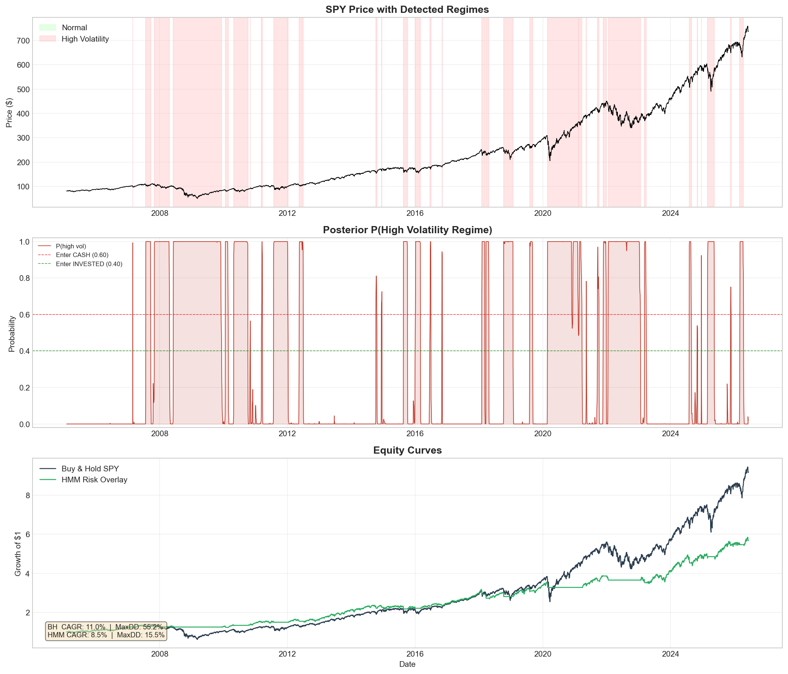
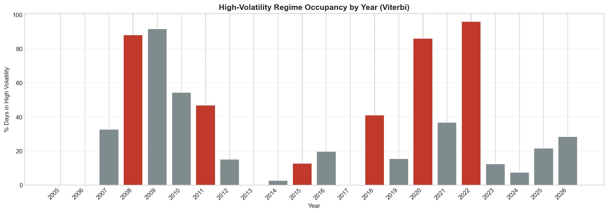
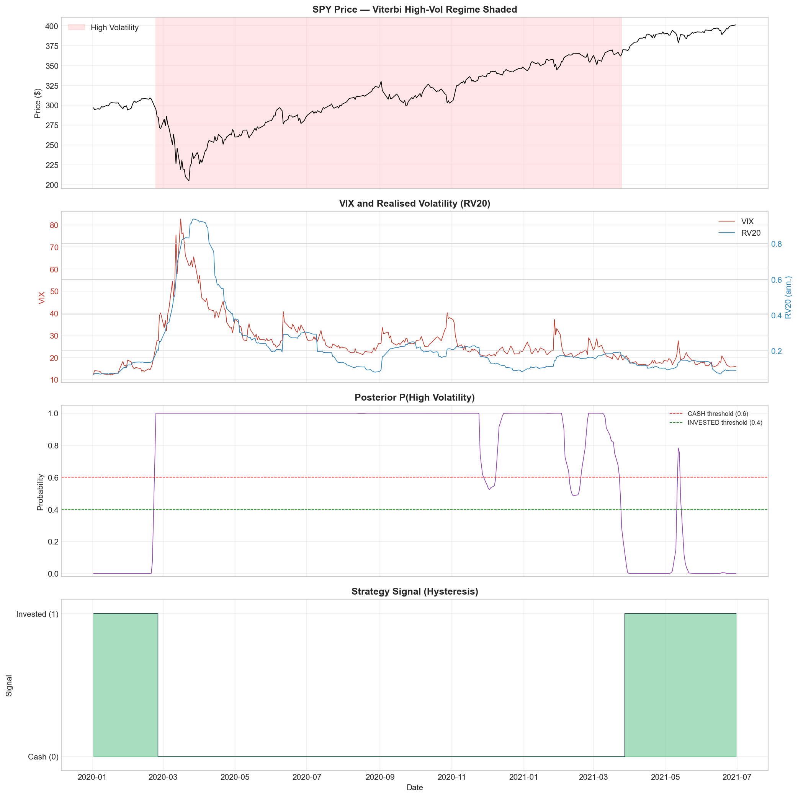
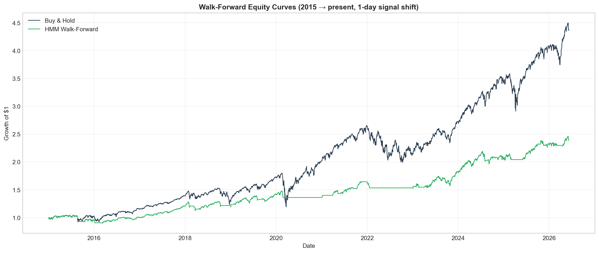
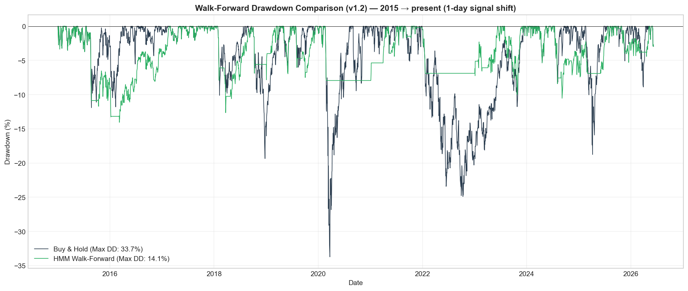

# Hidden Markov Models for Risk Regime Detection in Equity Markets

A Gaussian Hidden Markov Model (HMM) for identifying market stress regimes in US equities using SPY returns, realized volatility and the VIX.

The model is designed as a **risk overlay**, not as a return prediction system.

---

## Abstract

This project develops an interpretable Gaussian Hidden Markov Model (HMM) to identify normal and high-volatility market regimes in US equities.

Using daily SPY returns, 20-day realized volatility and the logarithm of the VIX, the model classifies hidden states and applies a risk overlay that reduces drawdowns during major stress periods.

The model was validated through:

- Full-sample analysis (2005–2026)
- Strict In-Sample / Out-of-Sample validation
- Walk-forward expanding-window validation

Results show substantial drawdown reduction and improved risk-adjusted returns, while preserving economic interpretability.

---

## Overview



---

# Key Contributions

- Interpretable Gaussian Hidden Markov Model.
- Major crises correctly identified.
- Strict In-Sample / Out-of-Sample validation.
- Walk-forward expanding-window validation.
- Significant drawdown reduction.
- Improved risk-adjusted performance.

---

## Features

The model uses three daily features:

### 1. SPY Log Returns

```math
r_t=\ln\left(\frac{P_t}{P_{t-1}}\right)
```

### 2. 20-Day Realized Volatility

```math
RV_{20}=\sigma_{20}(r)\sqrt{252}
```

### 3. Logarithm of the VIX

```math
\log(VIX)
```

---

## Model

Gaussian Hidden Markov Model

```python
GaussianHMM(
    n_components=2,
    covariance_type="full",
    n_iter=1000,
    random_state=42
)
```

The model infers two hidden states:

- Normal volatility regime
- High-volatility / crisis regime

Features are standardized using StandardScaler before fitting.

---

## State Identification

The crisis state is defined as the state with the highest combined average:

- Realized volatility
- log(VIX)

using original (non-scaled) feature values.

---

## Risk Overlay

The model does not predict returns.

Instead, it acts as a risk management overlay.

### Hysteresis

Switch to CASH if:

```text
P(high volatility) ≥ 0.60
for 3 consecutive days
```

Switch back to INVESTED if:

```text
P(high volatility) ≤ 0.40
for 3 consecutive days
```

---

# Validation

## v1.0 — Full Sample

Period:

2005–2026

Purpose:

- Interpretability
- Regime diagnostics

---

## v1.1 — Strict IS/OOS

Training:

2005–2018

Testing:

2019–2026

No retraining.

No parameter optimization.

---

## v1.2 — Walk-Forward Validation

Expanding-window approach:

Train → year t−1

Test → year t

Signal shifted by one day to avoid look-ahead bias.

---

# Main Results

## Drawdown Reduction

| Framework | Buy & Hold Max DD | HMM Max DD |
|------------|----------------:|------------:|
| Full Sample | 55.2% | 15.5% |
| OOS | 33.7% | 8.9% |
| Walk-Forward | 33.7% | 14.1% |

---

## Walk-Forward Performance

| Metric | Buy & Hold | HMM |
|----------|-----------:|-----------:|
| CAGR | 13.79% | 7.93% |
| Volatility | 17.63% | 9.19% |
| Sharpe | 0.782 | 0.863 |
| Max Drawdown | 33.72% | 14.05% |
| Total Return | 336% | 139% |

---

# Selected Figures

## High Volatility Occupancy by Year



---

## COVID Forensics



---

## Walk-Forward Equity Curves



---

## Walk-Forward Drawdowns



---

# Key Findings

- Major crises such as 2008, COVID and the 2022 bear market are correctly identified.
- Drawdowns are substantially reduced.
- Risk-adjusted performance improves.
- Results generalize out of sample.
- The model remains robust under walk-forward validation.
- The model detects persistent turbulence rather than short-lived crashes.

---

# Limitations

This model is designed to detect risk regimes.

It is **not** intended to:

- predict returns;
- optimize re-entry timing;
- maximize CAGR.

The current framework sacrifices return in exchange for lower drawdowns and improved risk-adjusted performance.

---

# Future Work

- Re-entry engine
- Dynamic exposure allocation
- Multi-state Hidden Markov Models
- Portfolio overlays
- Regime-aware portfolio optimization

---

# Repository Structure

```text
src/
scripts/
data/
reports/
figures/
docs/
paper/
linkedin/
presentation/
```

---

# References

- Hamilton, J. D. (1989)
- Rabiner, L. R. (1989)
- Ernest P. Chan (2017)
- hmmlearn
- yfinance
- scikit-learn

---

# License

MIT License.

---

### Current Scientific Version

**v1.2 — Walk-Forward Validated Gaussian HMM Regime Detector**